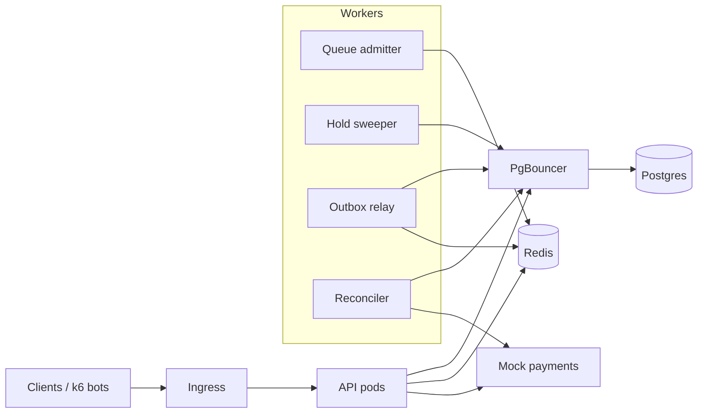

# ticket

A Ticketmaster-style backend built to survive a flash sale: 50,000 users trying to buy 5,000 seats in the same minute, with **zero seats ever sold twice**. Every component exists to exercise a core backend concept: relational modeling and transactions, caching, rate limiting, queues, containers, Kubernetes, CI/CD, security, reliability under failure, observability, and load testing.

- Design spec: [`docs/superpowers/specs/2026-10-01-ticketing-system-design.md`](docs/superpowers/specs/2026-10-01-ticketing-system-design.md)
- How each phase works, in plain language: [`docs/LEARNING.md`](docs/LEARNING.md)
- Decisions and their tradeoffs: [`docs/decisions/`](docs/decisions/)
- Load-test results: [`BENCHMARKS.md`](BENCHMARKS.md)

## Architecture



Postgres is the only authority on who owns a seat; constraints in the schema make double-selling impossible even if application code is wrong. Redis absorbs reads and enforces fairness. Workers handle everything time-based or asynchronous.

## Run locally

Requires Docker and Go 1.27.

```bash
cp .env.example .env        # then replace every value
docker compose --env-file .env -f deploy/compose/docker-compose.yml up --build
```

The API listens on `http://localhost:8080`. The OpenAPI contract is [`api/openapi.yaml`](api/openapi.yaml). Emails listed in `ADMIN_EMAILS` become admins when they register.

Check the whole flow end to end against the running stack:

```bash
go run ./tools/smoke        # prints SMOKE OK
```

## Run on Kubernetes (kind)

Requires kind, kubectl, helm, and openssl as well.

```bash
deploy/kind/up.sh                              # 3-node cluster, Traefik, cert-manager, metrics-server, the chart
BASE_URL=http://localhost go run ./tools/smoke # end-to-end through the ingress (https://localhost also works, self-signed)
deploy/kind/kill-api-during-sale.sh 60         # 60s flash sale while deleting API pods; must end with zero failures
```

## Run tests

```bash
go test ./...               # unit + integration; needs Docker running (Testcontainers)
go test -short ./...        # unit tests only, no Docker
```

Integration tests start one Postgres container per package and give every test its own freshly migrated database (cloned from a template), so tests are isolated and fast.

## Regenerate code

Generated code is committed so `go build` works without extra tools.

```bash
go generate ./internal/httpapi                                              # OpenAPI → internal/httpapi/gen
docker run --rm -v "$PWD:/src" -w /src sqlc/sqlc:1.30.0 generate            # SQL → internal/db/sqlc
```

## Layout

| Path | What |
| --- | --- |
| `api/openapi.yaml` | API contract (source of truth for HTTP types) |
| `services/api` | API binary: `serve`, `migrate`, `healthcheck` |
| `services/workers` | Background jobs: `sweeper`, `availability`, `admitter`, `reconciler`, `outbox-relay`, `notifier` |
| `services/payments_mock` | Fake payment provider with injectable latency and failures |
| `Dockerfile` | One image recipe for every service (`--build-arg SERVICE=…`) |
| `internal/db` | Migrations (embedded), sqlc queries, transaction helpers |
| `internal/auth` | Argon2id passwords, JWT access tokens, refresh tokens |
| `internal/account` | Register, login, refresh-token rotation |
| `internal/inventory` | Venues, events, seat maps |
| `internal/booking` | Holds, checkout, orders, cancellation, hold expiry, invariant checks |
| `internal/payments` | Payment client; `mock/` is the fake provider |
| `internal/idempotency` | Idempotency-Key middleware |
| `internal/cache` | Redis cache-aside for seat maps and events, availability counters, token revocation |
| `internal/waitingroom` | Virtual queue (Redis sorted set), batch admission, admission passes |
| `internal/outbox` | Outbox relay to Redis Streams; consumer groups with dedup |
| `internal/ratelimit` | Token-bucket limits in an atomic Redis Lua script, with in-process fallback |
| `internal/httpapi` | Router, middleware, handlers |
| `internal/testutil` | Postgres test harness |
| `deploy/compose` | Local Docker Compose stack |
| `deploy/helm/ticket` | Helm chart (values for local kind and cloud) |
| `deploy/kind` | kind cluster config, bootstrap script, pod-kill test |
| `tools/flashsale` | Timed on-sale load + correctness check against a live deployment |
| `tools/smoke` | End-to-end smoke check |

## Status

| Phase | | Status |
| --- | --- | --- |
| 1 | Foundation: auth, venues, events, seat maps, Compose | Done |
| 2 | Holds, checkout, mock payments, idempotency keys, expiry sweeper | Done |
| 3 | CI | Pending |
| 4 | Redis caching (versioned seat maps, stampede protection), token-bucket rate limits, access-token revocation | Done |
| 5 | Waiting room: FCFS Redis queue, batch admission, signed admission passes gating holds | Done |
| 6 | Reliability: retries + circuit breaker, transactional outbox, reconciler, graceful shutdown | Done |
| 7 | Kubernetes: Helm chart, kind, probes, HPA, PDB, PgBouncer, NetworkPolicies, TLS ingress | Done |
| 8 | Observability | Pending |
| 9 | Load and chaos testing | Pending |
| 10 | Delivery (GitOps) | Pending |
