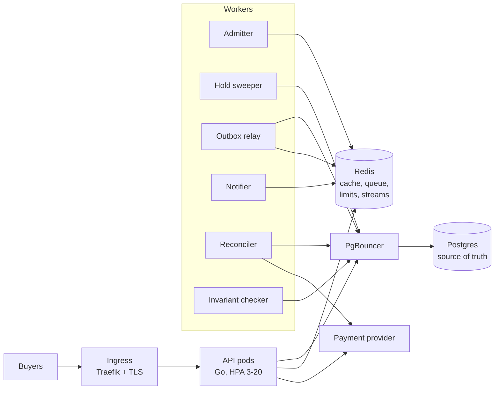

# ticket

A Ticketmaster-style backend built to survive a flash sale: 50,000 people trying to buy 5,000 seats in the same minute, with **zero seats ever sold twice**. It's a learning project for core backend engineering. Every component exists to exercise a specific concept (transactions and row locking, caching, rate limiting, queues, containers, Kubernetes, CI/CD, security, reliability under failure, observability, load testing), and every claim below has a test or a measured run behind it.

## Results

| | |
| --- | --- |
| **Correctness** | 0 double-sold seats and 0 money/seat mismatches across every load and chaos run (~2.6 M requests), checked by invariant queries after each run and by an alerting job in the cluster. |
| **50,000-buyer on-sale** | All 5,000 seats sold in 2–3 minutes with 0 failed requests, through a waiting room that admits 500 buyers every 10 s (`loadtest/onsale`, in-cluster). The baseline failed 46,687 requests; eight measured fixes got it to zero. |
| **Seat-map reads (k6)** | p99 **73 ms at 200 req/s, 182 ms at 500 req/s**, 0% errors (5,000-seat map, through the ingress). |
| **Chaos** | An API pod, the payment service, Redis, the reconciler and the outbox relay are killed mid-sale while payments fail 40% of the time: 0 failed operations; afterwards 0 orders stuck pending, every event published, every refund done. |
| **Pod kills** | 60 s sale with an API pod deleted every 15 s: 0 failed orders, 0 client retries needed (graceful drain). Runs in CI on every pull request. |
| **Delivery** | Merging to `main` runs lint, tests (with the race detector), image scans, a Compose smoke test and a kind end-to-end sale, then promotes the build through GitOps (Argo CD). No manual deploy steps. |

The full story of each run, including the ones that failed and what they found, is in [`BENCHMARKS.md`](BENCHMARKS.md).

## Architecture



- **Postgres decides who owns a seat.** Holds lock rows with `FOR UPDATE SKIP LOCKED`, and constraints (one valid ticket per seat, state/reference checks) make double-selling impossible even if application code is wrong.
- **Redis absorbs the read storm and enforces fairness**: versioned, pre-encoded seat-map cache; token-bucket rate limits in an atomic Lua script; a first-come-first-served waiting room; Redis Streams for events. It is never the authority, and every Redis failure degrades to Postgres instead of failing requests.
- **Payments are treated as unreliable**: idempotency keys on every call, retries with jitter, a circuit breaker, and a reconciler that settles any order whose outcome was lost. A transactional outbox makes sure no order event is lost or published for a change that rolled back.
- **Observable**: RED metrics per route, JSON logs carrying request and trace ids, OpenTelemetry traces from HTTP through SQL to the payment call, an on-sale Grafana dashboard, and unit-tested alert rules.

## Documentation

- [`docs/LEARNING.md`](docs/LEARNING.md): every phase explained in plain language, with the reasoning behind the code.
- [`docs/decisions/`](docs/decisions/): ten architecture decision records, each with its tradeoffs.
- [`BENCHMARKS.md`](BENCHMARKS.md): every load and chaos run, before and after each fix.
- [`api/openapi.yaml`](api/openapi.yaml): the API contract; server types are generated from it.
- [Design spec](docs/superpowers/specs/2026-10-01-ticketing-system-design.md) and [implementation plans](docs/superpowers/plans/).

## Run it

**Docker Compose** (Docker and Go 1.27):

```bash
cp .env.example .env        # then replace every value
docker compose --env-file .env -f deploy/compose/docker-compose.yml up --build
go run ./tools/smoke        # end to end: register, buy, cancel, waiting room -> SMOKE OK
```

The API is on `http://localhost:8080`, Grafana (on-sale dashboard) on `:3000`, Prometheus on `:9090`, and Jaeger on `:16686`. Emails listed in `ADMIN_EMAILS` become admins when they register.

**Kubernetes on kind** (adds kind, kubectl, helm, openssl):

```bash
deploy/kind/up.sh                                     # 3-node cluster, Traefik, cert-manager, monitoring, the chart
BASE_URL=http://localhost:18080 go run ./tools/smoke  # through the ingress (https://localhost:18443 too)
deploy/kind/gitops-up.sh                              # optional: hand the cluster to Argo CD (deploys follow main)
```

**Load and chaos tests** (on kind):

```bash
loadtest/job.sh my-run 50000                   # 50,000-buyer on-sale inside the cluster; client and server-side numbers
loadtest/k6-job.sh loadtest/k6/seatmap.js seatmap-reads EVENT_ID=<uuid>   # read throughput
BASE=http://localhost:18080 loadtest/chaos.sh   # kill pods, Redis, payments mid-sale; must settle with 0 violations
deploy/kind/kill-api-during-sale.sh 60          # pod-kill test (also in CI)
loadtest/profile-under-load.sh                  # CPU profile of an API pod under load
```

**Tests:**

```bash
go test ./...               # unit + integration against real Postgres and Redis (Testcontainers; needs Docker)
go test -short ./...        # unit tests only
```

Each integration test gets its own freshly migrated database, cloned from a template in milliseconds.

## Delivery

Every pull request runs: gofmt/goimports, golangci-lint and `go vet`; generated-code freshness; unit and integration tests with the race detector and coverage; Trivy dependency and image scans (fail on critical; one real critical CVE was caught); image builds; Helm lint and kubeconform; `promtool` alert-rule tests; a Compose smoke test; and a kind cluster running the smoke test plus a 60 s sale with pod kills. `main` is protected and requires all of them.

On merge, CI pushes images to GHCR tagged with the commit SHA and, if everything passed, commits that SHA to the `gitops` branch. Argo CD applies it to the cluster within a minute. Rolling back is a `git revert` on `gitops` (ADR 0010).

## Layout

| Path | What |
| --- | --- |
| `api/openapi.yaml` | API contract (source of truth for HTTP types) |
| `services/api` | API binary: `serve`, `migrate`, `healthcheck` |
| `services/workers` | Background jobs: `sweeper`, `availability`, `admitter`, `reconciler`, `outbox-relay`, `notifier`, `invariants` |
| `services/payments_mock` | Fake payment provider with injectable latency and failures |
| `internal/booking` | Holds, checkout, orders, cancellation, hold expiry, reconciliation, invariant checks |
| `internal/inventory` | Venues, events, seat maps |
| `internal/account`, `internal/auth` | Registration and login; Argon2id, JWTs, rotating refresh tokens, signed ticket QR codes |
| `internal/waitingroom` | Virtual queue (Redis sorted set), batch admission, admission passes, server-directed polling |
| `internal/cache` | Redis cache-aside: pre-encoded seat maps, events, availability counters, token revocation |
| `internal/ratelimit` | Token buckets in an atomic Redis Lua script, with in-process fallback |
| `internal/idempotency` | Idempotency-Key middleware |
| `internal/payments` | Payment client with retries and circuit breaker; `mock/` is the fake provider |
| `internal/outbox` | Outbox relay to Redis Streams; idempotent consumer groups |
| `internal/metrics`, `internal/observability` | Prometheus metrics; JSON logs with request/trace ids; OpenTelemetry |
| `internal/httpapi` | Router, middleware, handlers |
| `internal/db` | Embedded migrations, sqlc queries, transaction helpers |
| `deploy/compose` | Docker Compose stack, Prometheus and Grafana provisioning |
| `deploy/helm/ticket` | Helm chart (`values-local.yaml` for kind, `values-cloud.yaml` for managed services); alert rules and dashboard in `files/` |
| `deploy/kind`, `deploy/argocd` | Local cluster bootstrap, pod-kill test, Argo CD root application |
| `deploy/observability` | Dashboard generator, alert-rule tests, latency-spike drill |
| `loadtest/`, `tools/` | On-sale simulator, seeder, k6 scripts, chaos and profiling scripts, flash sale and smoke checks, results |

## Status

All ten build phases from the spec are done, each merged through a pull request (`git log --merges`): foundation, holds and checkout, CI, caching and rate limiting, waiting room, reliability, Kubernetes, observability, load and chaos testing, and GitOps delivery. The optional canary releases and cloud deployment are not done. The next known bottleneck (Redis client pool waits under the full on-sale) is described at the end of the "What each change fixed" section of `BENCHMARKS.md`.
