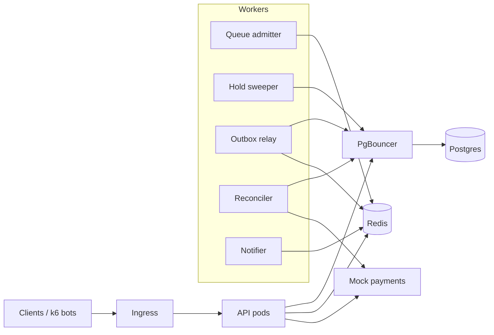

# Ticketing System Design Doc

Oct 1, 2026 · @Timothy Ng

## Overview and goals

Build a Ticketmaster-style system that survives a flash sale: 50,000 users trying to buy 5,000 seats in the same minute, with zero seats ever sold twice. The project exists to learn and demonstrate core backend engineering, so every component is chosen because it forces a specific concept.

**Learning goals:** API design, relational data modeling and transactions, caching, rate limiting, queues, containers, Kubernetes, CI/CD, security, reliability under failure, observability, and load testing.

**Success metrics (the resume line):**

- 0 double-sold seats across all load and chaos tests
- Sustains a simulated on-sale of 50,000 users with p99 latency under a target you set after the first baseline (for example, 300 ms for seat-map reads)
- Survives killing any single pod mid-sale with no lost or duplicated orders
- Every merge to main runs tests, builds images, and deploys automatically

**Out of scope:** real payments, real emails, a polished frontend, and multi-region deployment. A minimal web UI is optional; the system is driven through its API and a load-test bot army.

## Requirements

**Functional**

1. Admins create venues, seat layouts (sections, rows, seats), events, and price tiers.
2. Users register, log in, and browse events and a live seat map.
3. For high-demand events, users enter a virtual waiting room and are admitted in batches.
4. Admitted users hold up to 8 seats for 10 minutes; unpaid holds expire and release the seats.
5. Users check out held seats; a mock payment service charges them; a confirmed order issues tickets with a signed QR payload.
6. Users view and cancel orders; cancellation refunds and releases seats.
7. Order confirmation triggers an asynchronous notification (logged, not emailed).

**Non-functional**

| Property | Requirement |
| --- | --- |
| Correctness | A seat is never sold or held by two users at once, under any concurrency or failure |
| Availability | Losing any one pod causes no lost orders; reads stay up if the payment service is down |
| Latency | Seat-map reads served mostly from cache; holds and checkout stay fast under the flash-sale load |
| Scalability | Stateless services scale horizontally; autoscaling handles the on-sale spike |
| Fairness | Waiting-room admission is first-come, first-served and bots are rate limited |
| Security | Auth on every write, least-privilege access, no secrets in code or images |
| Operability | Metrics, structured logs, and traces for every request; one-command local setup |

## Architecture

A stateless API sits behind an ingress; Postgres is the only authority on seat ownership, Redis absorbs reads and enforces fairness, and background workers handle everything time-based or asynchronous.

Every request enters through the ingress; workers never talk to clients, only to Postgres, Redis, and (for the reconciler) the payment service.

| Layer | Choice | Why |
| --- | --- | --- |
| API | Go 1.27, chi router, pgx + sqlc | Built-in concurrency, fast, small static binaries, type-safe SQL |
| Database | Postgres 16 + PgBouncer | Transactions and row locks make double-selling impossible |
| Cache, queue, limits | Redis 7 (sorted sets, Streams, Lua) | Fast reads, atomic scripts, simple queues |
| Payments | Mock Go service | Inject latency and failures on demand |
| Containers | Docker, Docker Compose | One-command local setup |
| Orchestration | Kubernetes (kind locally), Helm | Scaling, self-healing, rolling deploys |
| CI/CD | GitHub Actions, Argo CD | Tests on every PR, GitOps deploys |
| Observability | Prometheus, Grafana, OpenTelemetry, Loki | Metrics, traces, logs |
| Load and chaos | k6, Chaos Mesh | Simulated on-sales and failure injection |

## Data model

Postgres is the source of truth for seats, holds, and orders; the database itself must make double-selling impossible, not just the application code. Use migrations (golang-migrate) for every schema change, and generate type-safe query code with sqlc.

| Table | Key columns | Notes |
| --- | --- | --- |
| users | id, email (unique), password\_hash, role, created\_at | Argon2id hashes; role is `user` or `admin` |
| refresh\_tokens | id, user\_id, family\_id, token\_hash (unique), expires\_at, revoked\_at, replaced\_by, created\_at | SHA-256 of the token, never the raw value; `family_id` groups a rotation chain |
| venues | id, name, timezone |  |
| sections | id, venue\_id, name |  |
| seats | id, section\_id, row\_label, seat\_number | Physical seat; unique (section\_id, row\_label, seat\_number) |
| events | id, venue\_id, name, starts\_at, on\_sale\_at, status | status: draft, on\_sale, sold\_out, ended |
| event\_seats | id, event\_id, seat\_id, price\_cents, state, hold\_id, order\_id, version | One row per seat per event; state: available, held, sold |
| holds | id, event\_id, user\_id, expires\_at, status | status: active, converted, expired, released |
| orders | id, user\_id, event\_id, hold\_id, total\_cents, status, idempotency\_key (unique) | status: pending\_payment, confirmed, failed, cancelled, refunded; at most one non-failed order per hold (see constraints) |
| payments | id, order\_id, provider\_ref, amount\_cents, status, idempotency\_key (unique) | Mirrors the mock payment service |
| tickets | id, order\_id, event\_seat\_id, status, qr\_token, created\_at | status: valid, void; one valid ticket per seat (see constraints) |
| idempotency\_keys | user\_id, key, request\_hash, response\_status, response\_body (jsonb), created\_at, expires\_at | Primary key (user\_id, key); rows older than 24 hours are deleted by a cleanup job |
| outbox | id, aggregate\_id, event\_type, payload (jsonb), created\_at, published\_at | Transactional outbox for reliable events |
| audit\_log | id, actor\_id, action, target, metadata (jsonb), created\_at | Admin and security-relevant actions |

**Constraints that enforce correctness:**

- `event_seats`: unique (event\_id, seat\_id); a check that `hold_id` is set only when state is `held` and `order_id` only when `sold`.
- `tickets`: partial unique index on `(event_seat_id) where status = 'valid'`, so one seat can never have two valid tickets even if application logic fails. Cancellation voids the old ticket (it is kept for history), which lets the seat be resold.
- `orders`: `idempotency_key` unique, so a retried checkout cannot create a second order; partial unique index on `(hold_id) where status <> 'failed'`, so a hold has at most one live order but a failed payment does not block a fresh attempt (with a new `Idempotency-Key`).
- `idempotency_keys`: primary key `(user_id, key)`, so keys are scoped per user and one user's key can never replay another user's response.

**Indexes:** `event_seats (event_id, state)` for seat maps and availability counts; `holds (status, expires_at)` for the expiry sweeper; `orders (user_id, created_at desc)`; `idempotency_keys (expires_at)` and `refresh_tokens (family_id)` for cleanup and revocation; partial index on `outbox (created_at) where published_at is null`.

## API specification

REST over HTTPS, JSON bodies, versioned under `/v1`, with an OpenAPI spec written first and checked into the repo; server types are generated from it with oapi-codegen. Every state-changing request requires a JWT and an `Idempotency-Key` header.

| Method and path | Purpose | Auth |
| --- | --- | --- |
| POST /v1/auth/register | Create account | None |
| POST /v1/auth/login | Returns short-lived access token and refresh token | None |
| POST /v1/auth/refresh | Rotate tokens | Refresh token |
| POST /v1/auth/logout | Revoke the refresh token | Refresh token |
| GET /v1/events | List events (paginated, cursor-based) | None |
| GET /v1/events/{id} | Event details | None |
| GET /v1/events/{id}/seatmap | Seats with state and price | None (cached) |
| POST /v1/events/{id}/queue | Join waiting room; returns queue token and position | User |
| GET /v1/queue/{token} | Poll position; returns admission token when admitted | User |
| POST /v1/events/{id}/holds | Hold 1 to 8 seats | User + admission token |
| DELETE /v1/holds/{id} | Release a hold | User (owner) |
| POST /v1/holds/{id}/checkout | Create order and charge payment | User + Idempotency-Key |
| GET /v1/orders, GET /v1/orders/{id} | Order history and details | User (owner) |
| POST /v1/orders/{id}/cancel | Cancel and refund | User (owner) |
| POST /v1/admin/venues, /events, /events/{id}/publish | Manage inventory | Admin |
| GET /healthz, GET /readyz, GET /metrics | Liveness, readiness, Prometheus | Internal only |

**Errors** use one shape: `{"error": {"code": "SEAT_UNAVAILABLE", "message": "...", "request_id": "..."}}`. Key status codes: 400 validation, 401 unauthenticated, 403 forbidden, 404 not found, 409 conflict (seat taken, hold expired), 422 business rule, 429 rate limited with `Retry-After`, 503 dependency down.

**Idempotency:** the server stores each `Idempotency-Key` with the request hash and response for 24 hours in the `idempotency_keys` table, scoped per user. The key row is inserted before the handler runs, so two concurrent requests with the same key cannot both execute; the loser waits for or receives the stored response (409 if the first is still in flight). A repeat with the same key and body returns the stored response; the same key with a different body returns 422.

## Core flows

Three flows carry the system: admission, holding, and checkout; cancellation reverses a sale. Each event seat moves only along `available → held → sold`, with `held → available` on expiry or release and `sold → available` on cancellation.

**1. Waiting room (admission)**

1. When an event goes on sale, `POST /queue` adds the user to a Redis sorted set keyed by event, scored by arrival time; the user gets a signed queue token.
2. A queue worker admits users in batches (for example 500 every 10 seconds, configurable per event) by issuing a short-lived signed admission token (JWT, 15-minute expiry, bound to user and event).
3. Clients poll `GET /queue/{token}` with backoff; position and estimated wait come from the sorted set rank.
4. Only requests carrying a valid admission token can create holds. This caps load on the database to what it can handle.

**2. Holding seats**

1. The hold request runs in one Postgres transaction: `SELECT ... FROM event_seats WHERE id = ANY(:ids) AND state = 'available' FOR UPDATE SKIP LOCKED`.
2. If fewer rows return than requested, roll back and return 409 with the unavailable seats.
3. Otherwise insert the hold (expires\_at = now + 10 minutes), set those seats to `held` with the hold\_id, increment `version`, and commit.
4. After commit, invalidate the event's cached seat map and publish a `seats.changed` event.
5. A sweeper job runs every 15 seconds: finds holds where `status = 'active' AND expires_at < now()`, releases their seats in a transaction, and marks them expired. It uses `FOR UPDATE SKIP LOCKED` so several sweeper replicas never fight.

**3. Checkout and payment**

1. Validate the hold is active, owned by the user, and not expired. Create an order in `pending_payment` with the request's idempotency key, in the same transaction that locks the hold row.
2. Call the mock payment service with the order's idempotency key, a 3-second timeout, and retries with exponential backoff and jitter. The circuit breaker fails fast with 503 if payments are down.
3. On success, one transaction: mark the order `confirmed`, the hold `converted`, seats `sold`, insert tickets, and insert an `order.confirmed` row into the outbox.
4. On a definite payment failure, mark the order `failed` and leave the hold active until it expires, so the user can retry. A retry is a new checkout request with a new `Idempotency-Key`; it creates a new order, which the partial unique index on `orders.hold_id` allows because the earlier order is `failed`.
5. On an ambiguous result (timeout after the charge may have gone through), mark the order `pending_payment` and let a reconciliation job query the payment service by idempotency key and finish the order either way. This is the case that loses money in real systems, so it gets its own tests.

**4. Cancellation**

1. In one transaction: lock the order row, verify it is `confirmed` and owned by the user, mark it `cancelled`, set its tickets to `void`, and return its seats to `available` (clearing `order_id`, incrementing `version`). Insert an `order.cancelled` outbox row.
2. Call the payment service's refund endpoint with an idempotency key derived from the order id; on success mark the order `refunded`. A failed refund leaves the order `cancelled`, and the reconciliation job retries it.
3. After commit, bump the seat-map cache version. The seats can now be held and sold again; the voided tickets stay for history and fail QR verification.

## Caching and rate limiting

Redis absorbs the read storm and enforces fairness; it is never the source of truth for who owns a seat.

| What | Pattern | Key and TTL | Invalidation |
| --- | --- | --- | --- |
| Event list and details | Cache-aside | `event:{id}`, 5 min | On admin update |
| Seat map | Cache-aside, versioned | `seatmap:{event_id}:v{n}`, 2 s | Bump version on every hold, release, or sale |
| Availability counts | Counters updated after commit | `avail:{event_id}` | Recomputed from Postgres by a periodic job to fix drift |
| Sessions and revoked tokens | Lookup set | `revoked:{jti}`, until token expiry | On logout |

**Stampede protection:** when a hot key expires, only one request rebuilds it (a short Redis lock or single-flight in-process); others serve the stale value briefly. Add a small random jitter to TTLs.

**Rate limiting:** a token bucket per user and per IP, implemented as an atomic Redis Lua script so concurrent requests cannot both pass. Separate limits for reads, queue joins, holds (for example 5 per minute), and logins (to slow credential stuffing). Exceeded limits return 429 with `Retry-After`.

**Push updates (optional stretch):** stream seat-map changes to browsers over Server-Sent Events, fed by Redis pub/sub, instead of polling.

## Reliability

Every failure mode below has a named mechanism and a test that proves it.

| Failure | Mechanism |
| --- | --- |
| Two users grab the same seat | Row locks (`FOR UPDATE SKIP LOCKED`) plus unique constraints as the last line of defense |
| Client retries a checkout | Idempotency keys stored server-side; unique `orders.idempotency_key` |
| Payment service slow or down | Timeouts, retries with exponential backoff and jitter, circuit breaker, 503 with a clear error |
| Charge succeeded but we timed out | Reconciliation job queries payments by idempotency key and finishes the order |
| Crash between commit and publishing an event | Transactional outbox: events are written in the same transaction, then a relay publishes them and marks `published_at` |
| Duplicate event delivery | Consumers are idempotent (dedupe on event id) |
| Hold never released | Expiry sweeper; holds have `expires_at` in the database, not only in Redis |
| Redis goes down | Reads fall back to Postgres with stricter rate limits; queue pauses admission rather than admitting everyone |
| Pod killed mid-request | Graceful shutdown on SIGTERM (stop accepting, finish in-flight, close pools); readiness probe removes it from traffic first |
| Database overload | Connection pooling (PgBouncer), bounded worker pools, waiting room caps admitted users |

**Messaging:** use Redis Streams with consumer groups for the outbox relay and background jobs (notifications, analytics). Swapping in Kafka is a stretch goal, not a requirement.

## Security

Security is built in from Phase 1, not bolted on.

- **Authentication:** Argon2id password hashing; short-lived JWT access tokens (15 min) and rotating refresh tokens stored hashed in `refresh_tokens`; each refresh revokes the old token and issues a new one in the same family. Presenting an already-revoked refresh token is treated as theft and revokes the whole family. Logout revokes the refresh token.
- **Authorization:** role checks for admin routes and ownership checks on every hold and order (a user can never read or modify another user's order).
- **Input validation:** struct validation on every endpoint (go-playground/validator); parameterized queries only (sqlc and `pgx` parameters, never string-built SQL).
- **Abuse:** rate limits and the waiting room; signed, expiring queue and admission tokens so they cannot be forged or shared.
- **Tickets:** QR payload is an HMAC-signed token so a forged ticket fails verification.
- **Secrets:** never in code or images; Kubernetes Secrets locally, with Sealed Secrets or External Secrets for anything committed to git.
- **Transport:** TLS at the ingress; internal-only endpoints (`/metrics`, admin) not exposed publicly.
- **Containers:** non-root user, read-only root filesystem, minimal base images, resource limits.
- **Cluster:** NetworkPolicies so only the API can reach Postgres and only the payment client can reach the payment service; least-privilege service accounts.
- **Supply chain:** dependency and image scanning in CI (Trivy or Grype), pinned dependency versions, Dependabot.
- **Audit:** admin actions and security events written to `audit_log`.

## Containerization and Kubernetes

Everything runs locally with one command first (Docker Compose), then on a local Kubernetes cluster (kind or k3d), then optionally on a managed cluster (GKE or EKS).

**Docker**

- One multi-stage Dockerfile per service: build stage with dependencies, small runtime stage, non-root user, health checks.
- `docker-compose.yml` for local development: API, queue worker, sweeper, outbox relay, mock payments, Postgres, PgBouncer, Redis, Prometheus, Grafana.

**Kubernetes resources**

| Component | Kind | Notes |
| --- | --- | --- |
| API | Deployment + Service + HPA | 3 to 20 replicas, scales on CPU and request rate; readiness and liveness probes; PodDisruptionBudget |
| Queue admitter, sweeper, outbox relay, reconciler | Deployments | Safe to run several replicas thanks to `SKIP LOCKED` and consumer groups |
| Mock payment service | Deployment + Service | Configurable latency and failure rate for testing |
| Postgres | StatefulSet (CloudNativePG operator recommended) | Persistent volume; managed database if deploying to the cloud |
| PgBouncer | Deployment | Connection pooling in front of Postgres |
| Redis | StatefulSet or Helm chart |  |
| Ingress | Ingress controller (NGINX) + cert-manager | TLS, routing, request size limits |
| Config and secrets | ConfigMaps, Secrets | Mounted as environment variables |
| Monitoring | kube-prometheus-stack Helm chart | Prometheus, Grafana, Alertmanager |
| Migrations | Job (or Helm pre-upgrade hook) | Runs before new API pods start |

- Package everything as a **Helm chart** with values files for `local` and `cloud`.
- Set resource requests and limits on every container.
- Use rolling updates with `maxUnavailable: 0`; later, canary releases with Argo Rollouts.

## CI/CD

GitHub Actions runs on every pull request; merges to main deploy automatically through GitOps.

**On every pull request:**

1. Format and lint checks (gofmt, golangci-lint) and go vet.
2. Unit tests, then integration tests against real Postgres and Redis service containers; publish a coverage report.
3. Build Docker images; scan images and dependencies (Trivy); fail on critical vulnerabilities.
4. Validate Kubernetes manifests and the Helm chart (`helm lint`, kubeconform).
5. Spin up the stack in a kind cluster and run a short smoke test plus a 60-second concurrency test asserting zero double-sold seats.

**On merge to main:**

1. Build and push images to GitHub Container Registry, tagged with the commit SHA.
2. Update the image tag in the deployment config; Argo CD syncs the cluster to match git.
3. Database migrations run as a Job before new pods take traffic.
4. Rollback = revert the commit; Argo CD restores the previous version.

**Branch protection:** main requires passing checks and a pull request.

## Observability

You should be able to watch an on-sale live and explain every spike.

- **Metrics (Prometheus):** request rate, error rate, and latency histograms (p50, p95, p99) per endpoint; cache hit rate; queue length and admission rate; active holds; holds expired per minute; seats sold; payment success, failure, and timeout counts; circuit breaker state; database pool usage; outbox lag.
- **Dashboards (Grafana):** one "on-sale" dashboard with the above, plus the standard Kubernetes pod CPU, memory, and restart panels.
- **Logs:** structured JSON with a `request_id` on every line, propagated across services; collected with Loki (optional).
- **Traces:** OpenTelemetry spans through API, database, Redis, and payment calls, viewed in Jaeger or Tempo, so a slow checkout shows exactly where the time went.
- **Alerts:** p99 latency over target for 5 minutes, error rate over 1 percent, outbox lag growing, any double-sale invariant check failing, pods crash-looping.
- **Invariant checker:** a periodic job that queries for any seat with more than one ticket or a sold seat without a confirmed order, and alerts if it ever finds one.

## Testing, load testing, and chaos testing

The tests are the proof behind the resume line, so they get as much care as the features.

| Layer | What it covers | Tools |
| --- | --- | --- |
| Unit | Pricing, token signing, rate-limit math, state transitions | Go testing package + testify |
| Integration | Endpoints against real Postgres and Redis | Go tests + Testcontainers for Go |
| Concurrency | 500 parallel requests for the same 10 seats; assert exactly 10 succeed and no seat has two tickets | Goroutines + go test -race |
| Property-based | Random sequences of hold, release, expire, checkout, cancel never violate invariants | rapid (property-based testing for Go) |
| Contract | Responses match the OpenAPI spec | schemathesis |
| Load | Simulated on-sale: 50,000 users join the queue, admitted users hold and buy, everyone else polls the seat map | k6 or Locust |
| Chaos | Kill API pods, the payment service, Redis, and a worker mid-sale; inject payment latency and errors | kubectl delete, Chaos Mesh |

**Every load and chaos run ends with the invariant checker:** zero seats with two tickets, every sold seat tied to a confirmed order, every confirmed order paid exactly once.

**Benchmark log:** record each run's settings and results (throughput, p50 and p99 latency, error rate, cache hit rate) in `BENCHMARKS.md`. Find the bottleneck, fix it, rerun, and keep the before and after numbers. These become the project's headline results.

## Build phases

Each phase ends with a working, tested system and a merged pull request; do not start the next phase until its "done when" passes.

1. **Foundation.** Repo layout, Go service skeleton, Postgres with migrations and sqlc, users and auth, venues, events, seat maps, Docker Compose, test setup.
   - *Done when:* a user can register, log in, and fetch an event's seat map from a fresh `docker compose up`.
2. **Holds and checkout.** Seat holds with row locking, expiry sweeper, mock payment service, orders, tickets, idempotency keys.
   - *Done when:* the 500-parallel-requests concurrency test passes with exactly the right number of winners.
3. **CI.** GitHub Actions for lint, types, unit and integration tests, image builds, and scanning.
   - *Done when:* a pull request with a failing test is blocked automatically.
4. **Caching and rate limiting.** Redis cache-aside for events and seat maps, versioned invalidation, token-bucket rate limits.
   - *Done when:* repeated seat-map reads are served from cache and bursts return 429.
5. **Waiting room.** Queue join, batch admission worker, admission tokens required for holds.
   - *Done when:* a 10,000-user burst only lets admitted users create holds.
6. **Reliability.** Retries, circuit breaker, transactional outbox and relay, reconciliation job, graceful shutdown.
   - *Done when:* payment-service failures and timeouts never produce a lost or double-charged order.
7. **Kubernetes.** kind cluster, Helm chart, probes, HPA, PgBouncer, NetworkPolicies, Ingress with TLS.
   - *Done when:* deleting any API pod mid-test causes no failed orders.
8. **Observability.** Prometheus metrics, Grafana on-sale dashboard, structured logs, OpenTelemetry traces, alerts, invariant checker.
   - *Done when:* you can explain every latency spike during a load test from the dashboard.
9. **Load and chaos testing.** Full on-sale simulation, bottleneck hunting, chaos experiments, `BENCHMARKS.md`.
   - *Done when:* you have before-and-after numbers and zero invariant violations across all runs.
10. **Delivery.** Argo CD GitOps, optional canary releases, optional cloud deployment, README with an architecture diagram and results.
    - *Done when:* merging to main updates the running cluster with no manual steps.

## Instructions for the coding agent

Build the complete system in one continuous run, without pausing for approval between phases. The owner will study the code afterward, so it must stay readable and well documented.

- Build **one phase at a time**, in order. Commit each phase separately with a clear message so the git history shows how the system was built, and write \`docs/LEARNING.md\` explaining each phase's key concepts and design decisions in plain language.
- Write tests alongside each feature, never after. A phase is complete only when its "done when" check passes in CI. Before Phase 3 sets up CI, the check must pass locally.
- The owner has approved pushing to the GitHub remote. Each phase goes on a branch, opens a pull request, and is merged once checks pass.
- Prefer clarity over cleverness: small packages, clear interfaces, doc comments on exported identifiers and anything non-obvious, and comments explaining *why* (for example, why `SKIP LOCKED` instead of plain `FOR UPDATE`).
- Never weaken a correctness guarantee to make a test pass. If a test fails, find the real cause and explain it.
- Keep secrets out of the repo; use `.env.example` with placeholder values.
- Maintain `README.md` (setup, architecture, how to run tests and load tests), `docs/decisions/` (short architecture decision records for major choices), and `BENCHMARKS.md`.
- Suggested layout: `services/api`, `services/workers`, `services/payments_mock`, `deploy/compose`, `deploy/helm`, `loadtest/`, `docs/`.
- Default stack: Go 1.27, chi, pgx, sqlc, golang-migrate, go-redis, Go's testing package with testify and Testcontainers, Docker, kind, Helm, GitHub Actions, Prometheus, Grafana, OpenTelemetry, k6. Ask before substituting any of these.
- When a choice is ambiguous, pick the simpler option, note the tradeoff in a decision record, and continue.
